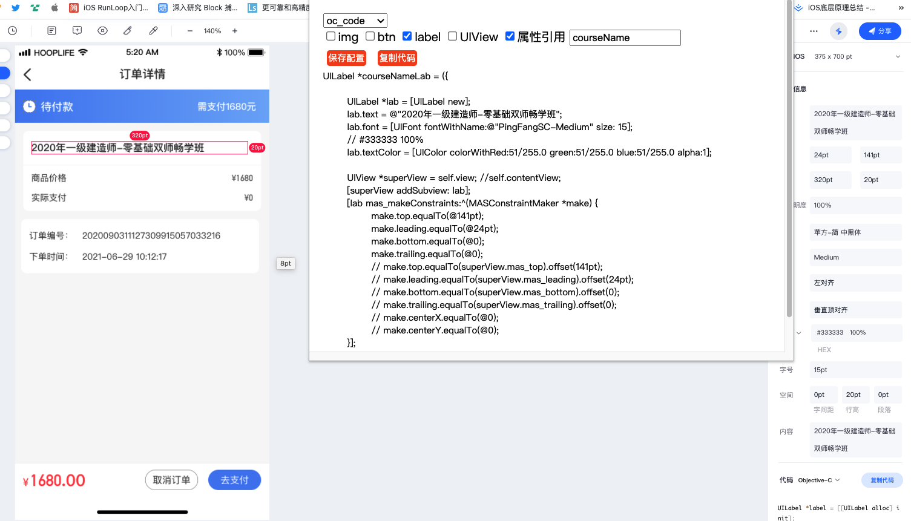

## 蓝湖生成iOS相关代码工具

### 效果

### 使用

1.安装插件(打开扩展页，打开开发者模式，点击加载已解压的扩展程序选择项目文件夹)

2.打开蓝湖，选中某个控件，点击插件图标(蓝)，弹出生成代码面板

### 后期规划
- [ ] 1.插件拦截请求

- [ ] 2.把json通过接口,传给服务器,或者用socket,传给另一台手机
- [ ] 3.服务器,或者手机,处理这一串json,生成tree返回给插件
- [ ] 4.插件展示tree,然后可以做一些简单的操作,我上面提到的
- [ ] 5.操作完后,可以点击某个控件生成代码,可以点击某父控件生成代码(子控件也会对应生成代码),也可以直接生成该页面的代码,我建议生成代码的逻辑也不要写在插件里面
- [ ] 6.可以保存操作后的tree数据到电脑上,下次可以自己选择打开读取
