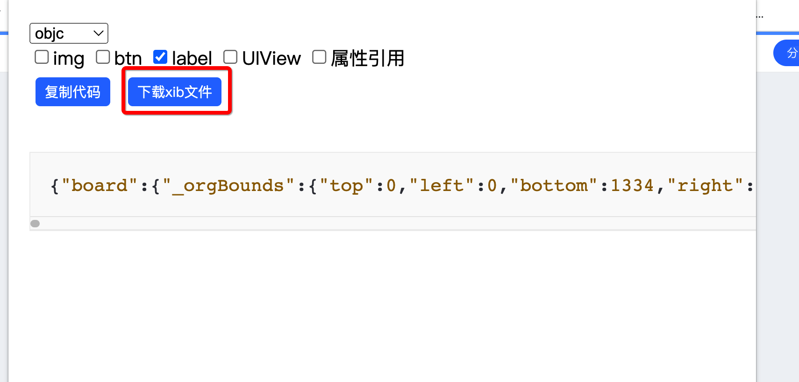

## 蓝湖生成iOS相关代码工具

### 效果
1.当你选中某个元素时，可生成单个控件

2.当你在一个页面，没有选中元素时，可生成整个页面的xib文件

### 使用

1.安装插件(打开扩展页，打开开发者模式，点击加载已解压的扩展程序选择项目文件夹)

2.打开蓝湖，选中某个控件，点击插件图标(蓝)，弹出生成代码面板

### 后期规划
- [ ] 1.支持安卓

- [ ] 2.支持生成整个页面
- [ ] 3.dart高亮问题

